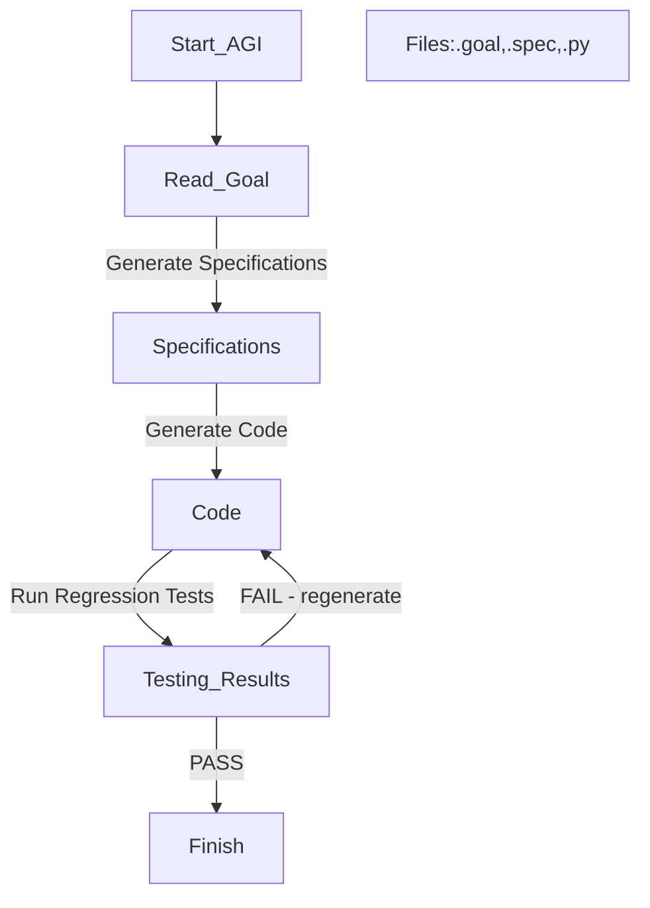

```mermaid

graph TD;
  Start_AGI --> Read_Goal;
  Read_Goal -->|Generate Specifications| Specifications;
  Specifications -->|Generate Code| Code;
  Code -->|Run Regression Tests| Testing_Results;
  Testing_Results-->|FAIL - regenerate| Code;
  Testing_Results -->|PASS| Finish;

  Files:.goal,.spec,.py

```
